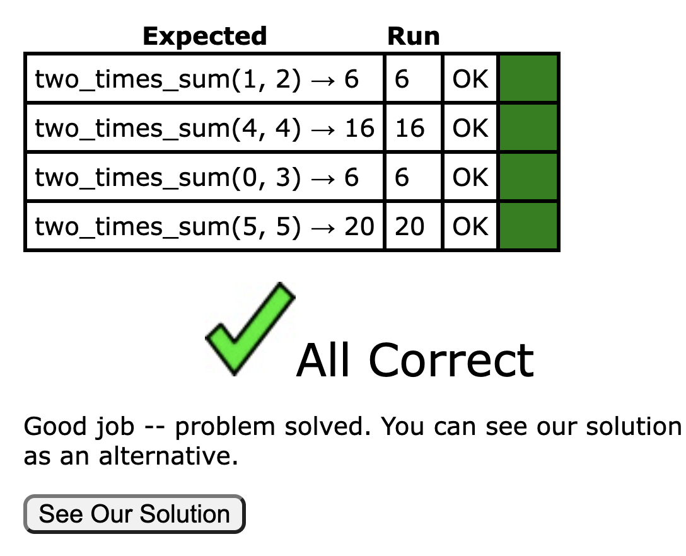

# Welcome

Welcome to week 2.

## Intro to CodingBat

### Exercise 1: Two Times Sum

For this week's lab, we'll be using a website called `CodingBat`. Unlike last week, where you were just running code on your own computer, you'll put your code into the `CodingBat` website and it will tell you whether you are right or wrong.

Start by going to this URL: [https://codingbat.com/prob/p254678](https://codingbat.com/prob/p254678).

Optionally, you can use "create account" in the top right of the page. Doing so will allow you to track your progress. This isn't required, and these exercises are not for a grade.

You should see something that looks like:


Your answer will go on the line with the cursor.

**Important:** In lab 1, you always gave your results by using `print`. In CodingBat, you'll instead use `return`. Unlike `print`, you should not use parentheses when using `return`. We'll talk about the difference between `print` and `return`.

As an example if this were week 1, your solution might look like:

```python
def two_times_sum(x, y):
	print(2*(x+y))
```

However, in lab 1, your solution should look like:

```python
def two_times_sum(x, y):
	return 2*(x+y)
```

Put in the code, click "Go", and you should see this:



### Exercise 2: Three Times Max Plus One

Now it's your turn to solve a problem on your own.

This time we'll work on this problem [https://codingbat.com/prob/p229485](https://codingbat.com/prob/p229485).

Start by giving the solution

```python
def three_times_max(x, y, z):
  return 3*x
```

Then click `Go`, and you'll see: 


The reason is that your code gives the correct result for the first example (5, 3, 1), but the wrong answers for the other two examples. 

Consider the second row: (1, 2, 3). The max here is 3. So three times the max is 9. However, this incorrect solution gives 3. Since 3 is not equal to 9, the test fails, and you get an ugly red box.

Correct the code. If you're stuck, try clicking "Show Hint".

Once you've passed this exercise, you're ready to start using the new material from lecture #2. 

## Booleans Practice

Recall the Boolean operators `not`, `and` and `or` from the lecture:
```python
not True == False
not False == True
True and True == True
True and False == False
False and True == False
False and False == False
True or True == True
True or False == True
False or True == True
False or False == False
```

Recall how `if-elif-else` blocks are structured:
```python
if a < 10:
	print("A is smaller than 10!")
elif a == 10:
	print("A is 10!")
else:
	print("I guess it is bigger than 10?")
```

For a further refresher, you can refer to the lecture slides on [Brightspace](https://brightspace.universiteitleiden.nl/d2l/le/lessons/240322/topics/2628793).

Now do the following exercises on `CodingBat`. For an additional challenge, you can try to do them without using `if-elif-else`.

- [cigar_party](https://codingbat.com/prob/p195669)
- [caught_speeding](https://codingbat.com/prob/p137202)
- [sorta_sum](https://codingbat.com/prob/p116620)
- [alarm_clock](https://codingbat.com/prob/p119867)
- [near_ten](https://codingbat.com/prob/p165321)
